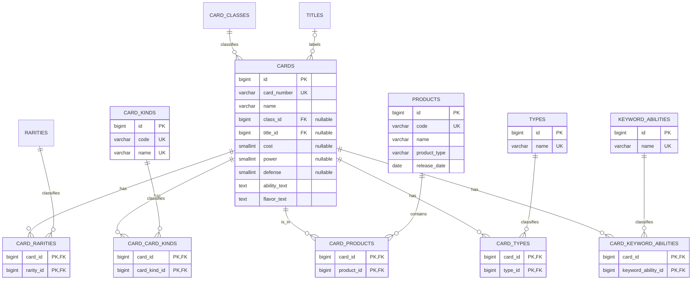

# ER 図

`cards` が中心テーブルです。カード番号はこのテーブルの一意なカラムであり、別テーブルには分けません。

カード種類、レアリティ、収録商品、タイプ、キーワード能力は、カードと多対多の関係です。そのため、それぞれ `card_card_kinds`、`card_rarities`、`card_products`、`card_types`、`card_keyword_abilities` を中間テーブルとして使用します。タイトルはコラボカードのみ設定するため、`cards.title_id` をNULL許容にしています。
